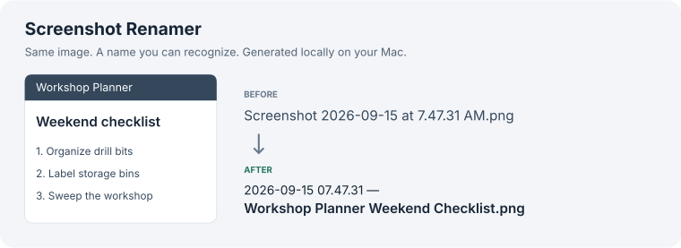

# Screenshot Renamer

An automatic macOS 27 utility that renames each new Desktop screenshot with a descriptive name using Apple's on-device Foundation Model. Once installed, it handles screenshots in the background as macOS saves them, then exits. No menu-bar icon, login app, polling loop, HTTP server, or custom model download.



Illustration using a synthetic workshop screenshot. The title shown is actual output from the local model during testing; the original timestamp name is illustrative. No personal screenshots are included.

## Use

After installation, use your normal screenshot shortcut. Each new screenshot saved to Desktop is renamed automatically after macOS finishes writing it. App names are inferred only from visible image content. No foreground-app inspection. Existing screenshots are not scanned or renamed.

Only files carrying Apple's `kMDItemIsScreenCapture` metadata are eligible. Screenshots copied only to the clipboard, saved elsewhere, or stripped of that metadata are not processed. Other Desktop additions can briefly launch the helper; they do not cause model inference. Failed/refused/timed-out generations leave the original filename intact. Apple manages model availability and memory; the helper does not control system model residency.

## Requirements

This is an early macOS 27 beta utility, tested on macOS 27.0 build **26A428**. Other beta builds and final releases have not been verified. It requires:

- An Apple Intelligence-compatible Mac with Apple Intelligence enabled and its system model ready.
- Apple's `/usr/bin/fm` with `respond --image` and `--schema` support. This is the Apple command included with macOS 27, not a third-party program of the same name.
- `/usr/bin/python3`, supplied by the developer tools on the tested Mac. If missing, install Apple's Command Line Tools with `xcode-select --install`.
- Folder Actions and permission for the automation to access Desktop. macOS may request Automation access to System Events.

Check these before installing:

```sh
/usr/bin/fm available
/usr/bin/fm respond --help
/usr/bin/python3 --version
```

`fm available` should report that the system model is available. Apple manages the model download; this project does not bundle model weights. The helper serializes overlapping requests and has a 45-second model timeout. Feature announcements are described in [Apple's CLI session](https://developer.apple.com/videos/play/wwdc2026/334/).

## Install

Download or clone the repository, then run from its directory:

```sh
/usr/bin/python3 install.py
```

The installer copies the helper files to `~/Library/Application Support/Screenshot Renamer`, compiles `Screenshot Renamer.scpt` into `~/Library/Scripts/Folder Action Scripts`, and attaches that script to Desktop using System Events. It enables Folder Actions globally and preserves existing scripts. If you already have disabled Folder Actions configured, review them before enabling the global switch. macOS may request Automation or Desktop access.

## Turn it off

```sh
osascript "$HOME/Library/Application Support/Screenshot Renamer/disable.applescript" "$HOME/Desktop"
```

This disables only this script and leaves any unrelated Folder Actions alone. No worker runs between events. An already-running request may finish. Installed files can stay for later re-enabling.

## Uninstall

```sh
/usr/bin/python3 "$HOME/Library/Application Support/Screenshot Renamer/uninstall.py"
```

This disables the trigger, waits for the current worker, and removes the installed helper, compiled script, and utility state. Screenshots stay where they are with their descriptive names. Other Folder Actions and the global switch remain as they were. The disabled registration may remain visible in Folder Actions Setup. Reinstall from this repository to enable the utility again.

## Troubleshooting

If a screenshot keeps its original name, confirm it was saved to Desktop and check `fm available`. Then open Folder Actions Setup and confirm the Desktop action and Screenshot Renamer script are enabled. Inspect `~/Library/Application Support/Screenshot Renamer/status.log` for status codes. Model refusals, timeouts, and missed folder events leave the original file intact.

## Privacy and reliability

Only the image is passed to the local system model. No transcript, image copies, filename history, app activity history, or model stderr is stored. `processed.json` keeps only the last 200 numeric file identities to prevent repeated processing. `status.log` contains timestamps and status codes only. State files are account-private. Names are sanitized and Darwin's exclusive atomic rename prevents overwrites. Only files less than five minutes old are eligible for automatic processing. Renaming preserves the image bytes and creation date; the new filename also includes the original creation timestamp.

Folder Actions are macOS's file-saved trigger mechanism for this workflow. The helper receives each file macOS adds to Desktop, confirms Apple's screenshot metadata before asking the model, then exits. It does not scan Desktop on startup. A cancelled/incomplete save or delayed/missed event can leave the standard name. A user rename during generation prevents the old path from being renamed. Model output is a fallible description; no screenshot text is executed.

## Tests

```sh
/usr/bin/python3 -m unittest discover -s . -p 'test_*.py'
```

Coverage: bytes/metadata/creation-date preservation, repeated events, collision handling, ordinary-image filtering, model failure, symlinks/outside paths, in-flight changes, numeric-only processing state and filename sanitization.

Uninstall tests use an isolated temporary home and verify removal, unrelated-script preservation, failure handling, and symlink refusal. They do not uninstall your running utility.

## License

[MIT](LICENSE). Apple software and services retain their own terms. This is an independent utility, not an Apple product.
